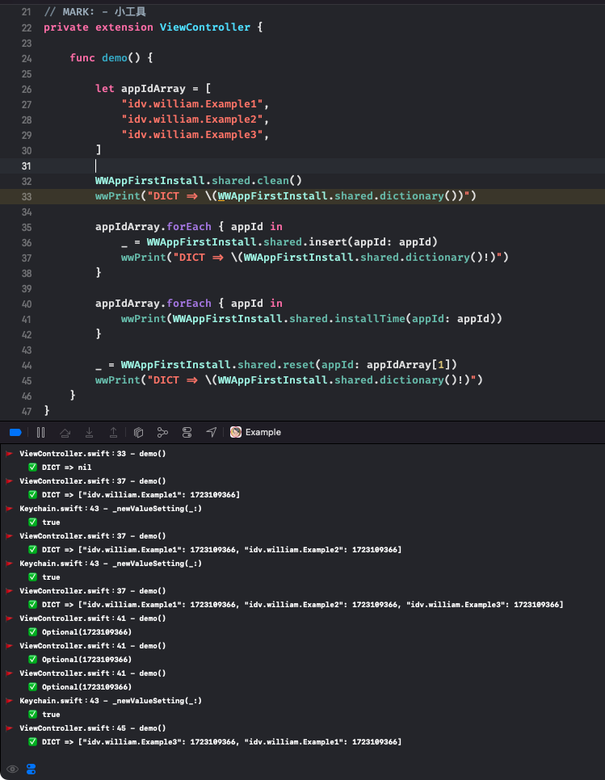

# WWAppFirstInstall

[](https://developer.apple.com/swift/) [](https://developer.apple.com/swift/)  [](https://developer.apple.com/swift/) [](https://developer.apple.com/swift/)

## [Introduction - 簡介](https://swiftpackageindex.com/William-Weng)
- Check whether the APP is installed for the first time?
- 檢測該APP是否為第一次安裝？



## [Installation with Swift Package Manager](https://medium.com/彼得潘的-swift-ios-app-開發問題解答集/使用-spm-安裝第三方套件-xcode-11-新功能-2c4ffcf85b4b)
```swift
dependencies: [
    .package(url: "https://github.com/William-Weng/WWAppFirstInstall.git", .upToNextMajor(from: "1.0.0"))
]
```

## Function - 可用函式
|函式|功能|
|-|-|
|insert(appId:)|加入AppId到紀錄之中|
|detect(appId:)|檢測該AppId是否有安裝過？|
|reset(appId:)|將安裝過的記錄刪除|
|installTime(appId:)|取得安裝時間 (秒)|
|dictionary()|取得安裝過的全記錄 => [<AppId>: <安裝時間>]|
|clean()|全紀錄清除|

## Example
```swift
import UIKit
import WWPrint
import WWAppFirstInstall

final class ViewController: UIViewController {

    override func viewDidLoad() {
        super.viewDidLoad()
        demo()
    }
}

private extension ViewController {
    
    func demo() {
        
        WWAppFirstInstall.shared.clean()
        
        let appIdArray = [
            "idv.william.Example1",
            "idv.william.Example2",
            "idv.william.Example3",
        ]
        
        wwPrint("DICT => \(WWAppFirstInstall.shared.dictionary())")

        appIdArray.forEach { appId in
            _ = WWAppFirstInstall.shared.insert(appId: appId)
            wwPrint("DICT => \(WWAppFirstInstall.shared.dictionary()!)")
        }
        
        appIdArray.forEach { appId in
            wwPrint(WWAppFirstInstall.shared.installTime(appId: appId))
        }
        
        _ = WWAppFirstInstall.shared.reset(appId: appIdArray[1])
        wwPrint("DICT => \(WWAppFirstInstall.shared.dictionary()!)")
    }
}
```
